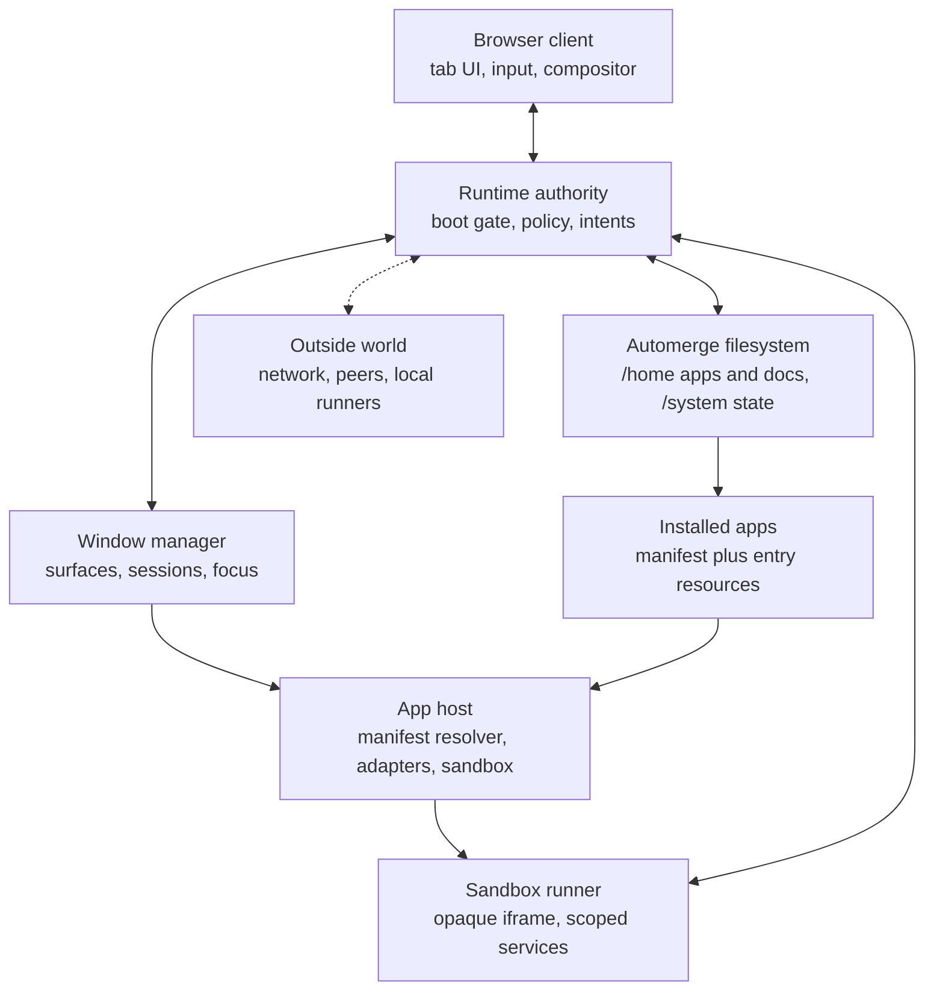

```mermaid
flowchart TB
  Browser["Browser client
tab UI, input, compositor"]
  Runtime["Runtime authority
boot gate, policy, intents"]
  Filesystem["Automerge filesystem
/home apps and docs, /system state"]
  Window["Window manager
surfaces, sessions, focus"]
  Host["App host
manifest resolver, adapters, sandbox"]
  Packages["Installed apps
manifest plus entry resources"]
  Sandbox["Sandbox runner
opaque iframe, scoped services"]
  External["Outside world
network, peers, local runners"]

  Browser <--> Runtime
  Runtime <--> Filesystem
  Runtime <--> Window
  Filesystem --> Packages
  Window --> Host
  Packages --> Host
  Host --> Sandbox
  Sandbox <--> Runtime
  Runtime <-.-> External
```
