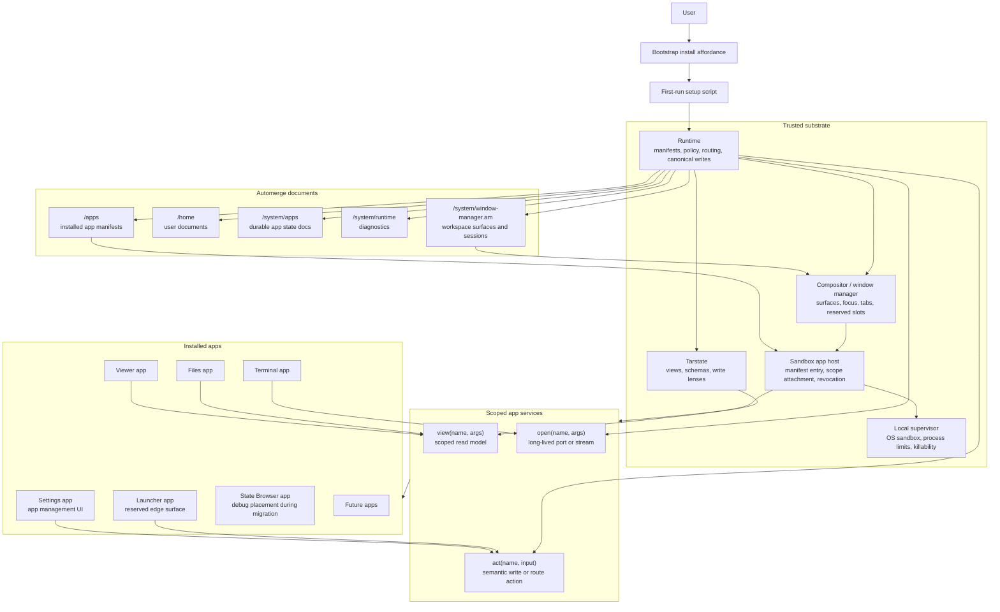

# Patchpit Planned Architecture

This is the planned smaller Patchpit shape. Product UI is installed apps.
Trusted code is only the runtime, compositor/window manager, app host, and local
supervisor needed to enforce scope and sandboxing.

## Rules

- `/apps` is the only installed-app registry.
- Settings, Launcher, Files, Viewer, Terminal, and State Browser are apps.
- The base bootstrap affordance can install the first apps, but it is not an app
  catalog, launcher, or package manager.
- Launcher placement is trusted compositor policy; Launcher rendering is normal
  app UI.
- Route and launch requests share one runtime admission path.
- Active app/session state is derived from workspace sessions and app-host
  diagnostics, not from a second app-instance registry.
- Apps see `view`, `act`, and `open`; projections, intents, and capabilities are
  runtime implementation categories.
- Tree metadata and file/media content travel separately.
- V0 is snapshot/reset-first for views and live-workspace-only for projections.
- The in-process bootstrap runtime is migration scaffolding. The planned owner
  is the SharedWorker runtime, with OS sandboxing added through a local
  supervisor where available.
