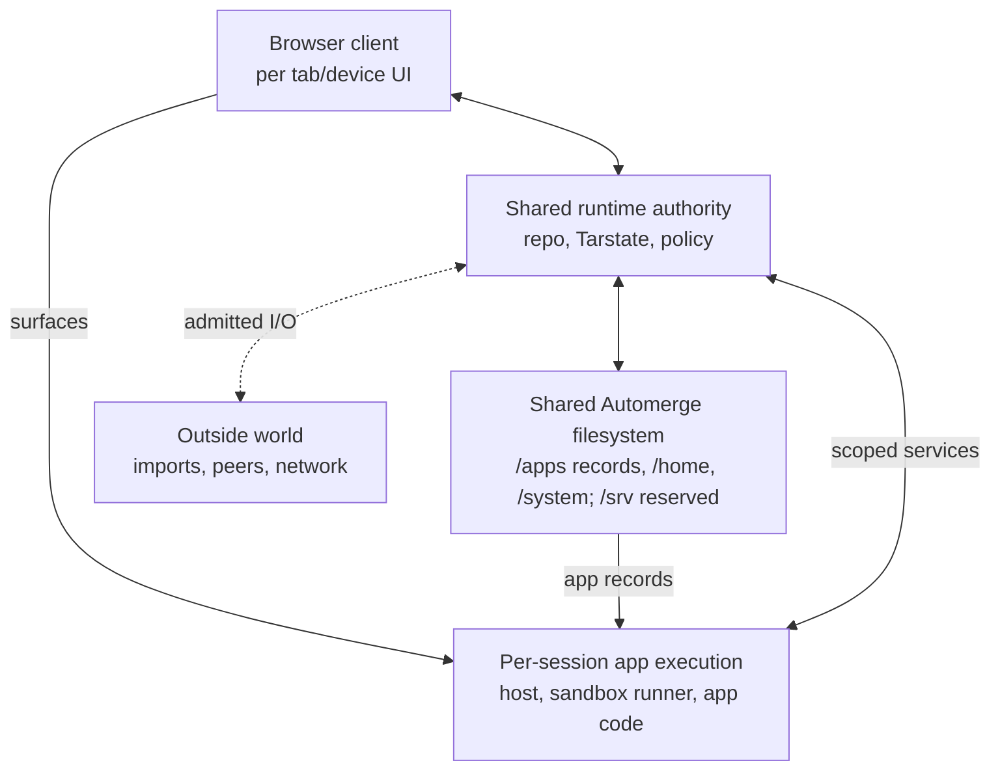

```mermaid
flowchart TB
  Client["Browser client
per tab/device UI"]
  Runtime["Shared runtime authority
repo, Tarstate, policy"]
  Filesystem["Shared Automerge filesystem
/apps records, /home, /system; /srv reserved"]
  Apps["Per-session app execution
host, sandbox runner, app code"]
  External["Outside world
imports, peers, network"]

  Client <--> Runtime
  Runtime <--> Filesystem
  Client -->|surfaces| Apps
  Filesystem -->|app records| Apps
  Apps <-->|scoped services| Runtime
  Runtime <-.->|admitted I/O| External
```
